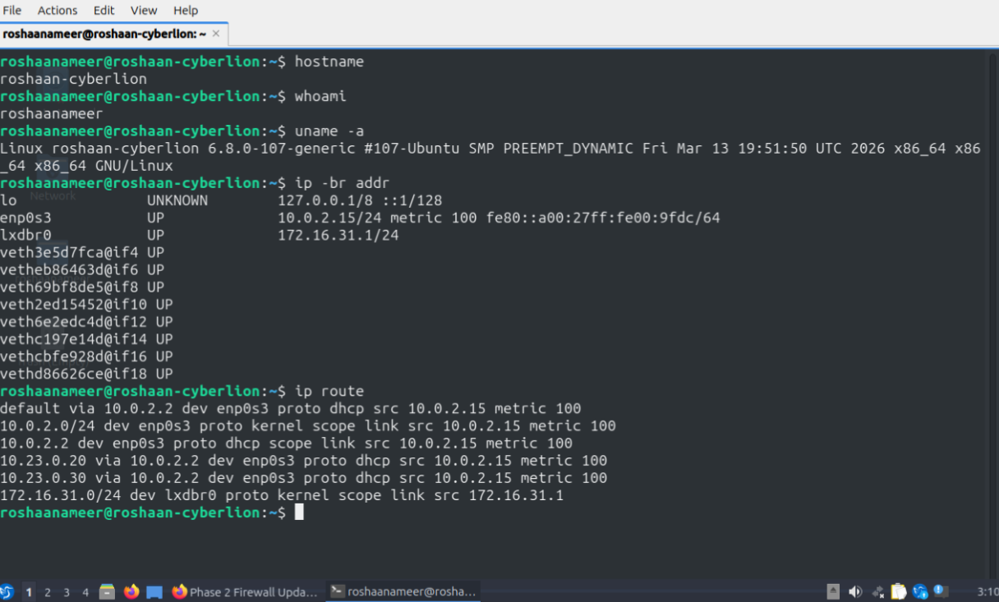
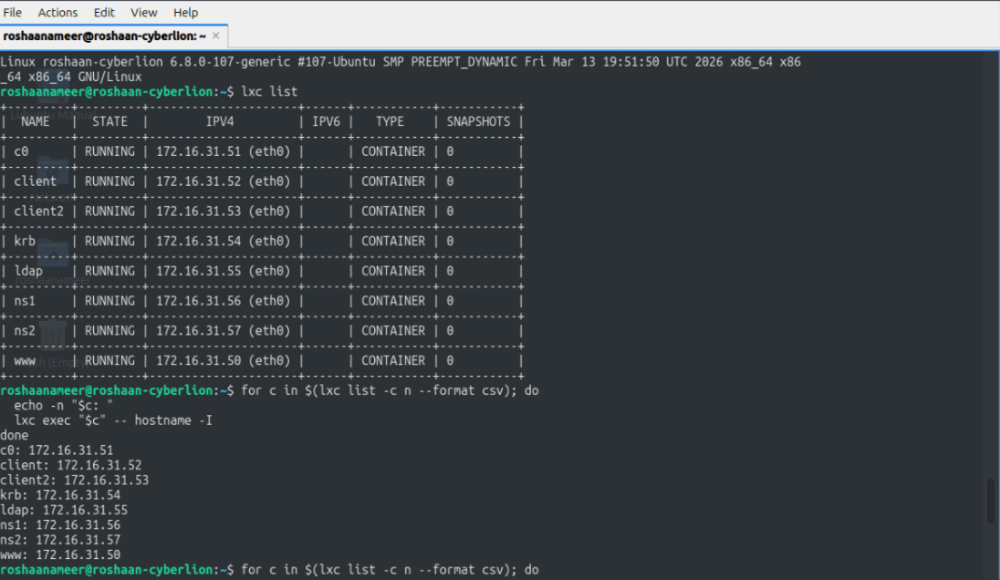
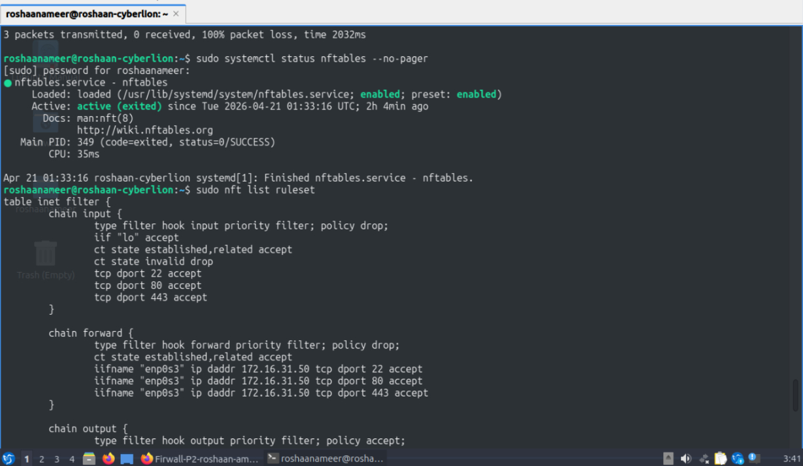
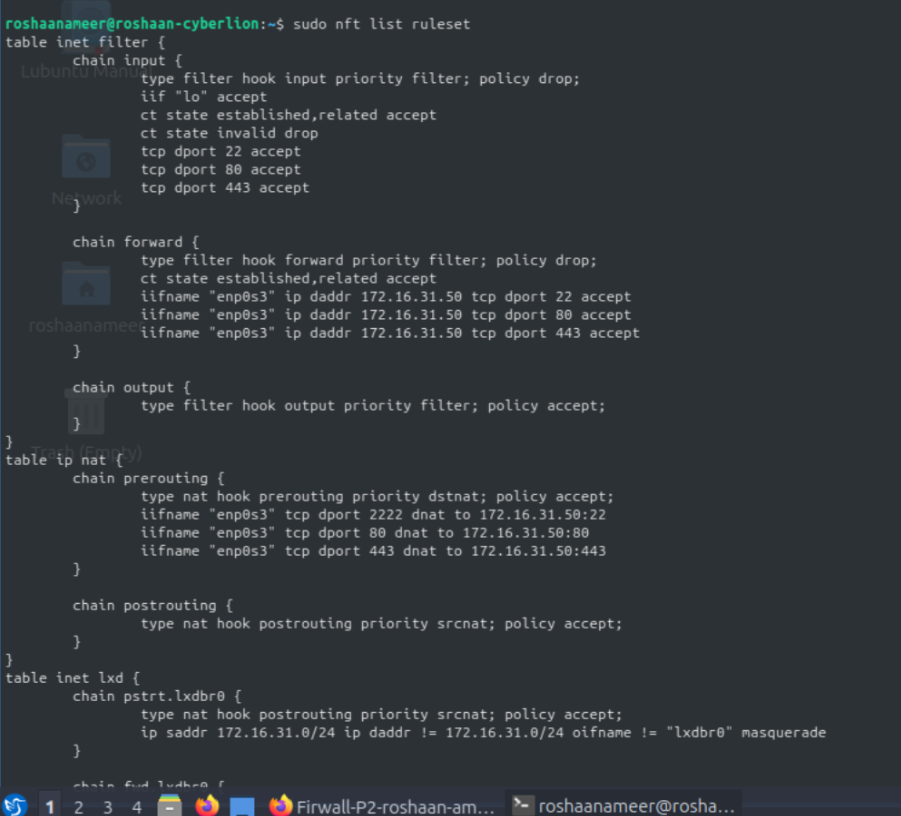
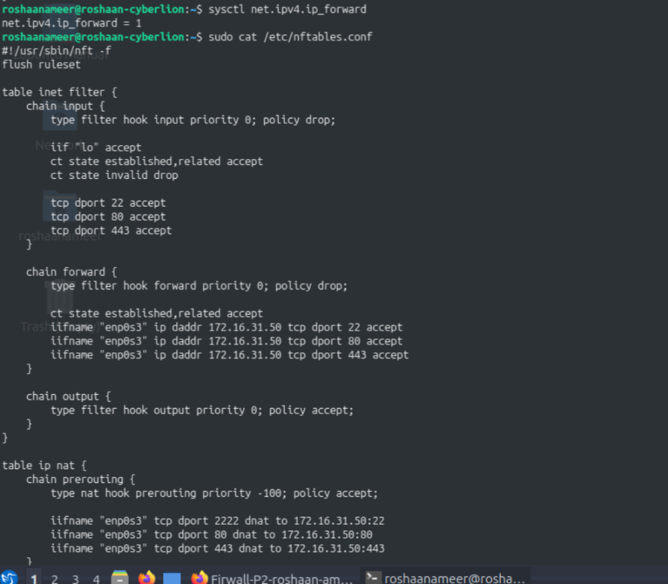
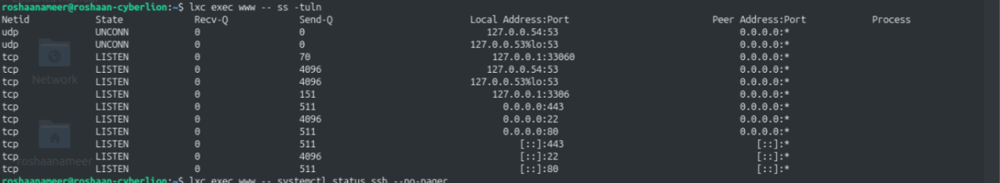
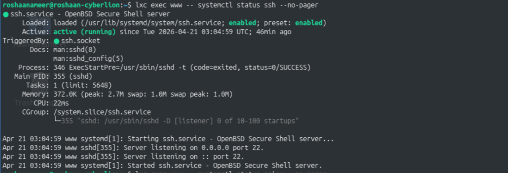
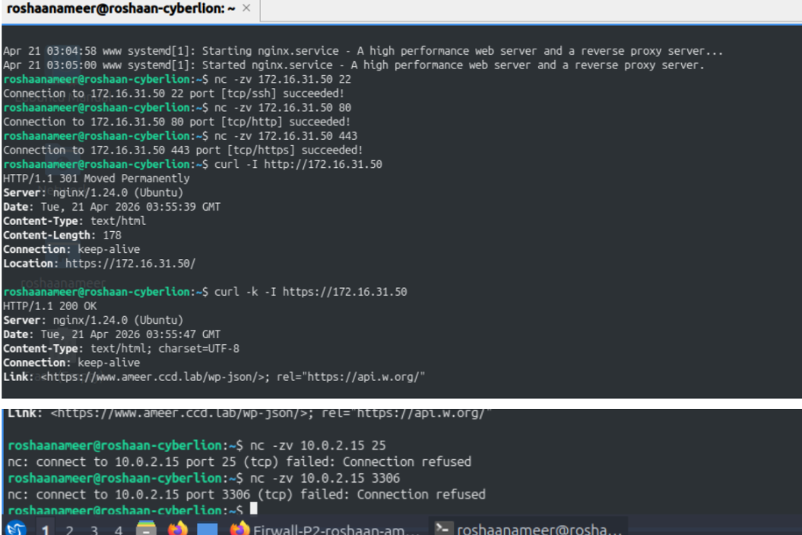

# 📁 Screenshots

This folder contains the screenshots used in the main project preview.

## 🖥️ Host Network Overview
Host system identity, interfaces, and routing details.

---

## 📦 LXC Container Address Verification
Running containers and their assigned IPv4 addresses.

---

## 🛡️ nftables Firewall Rules
Firewall service status and core filtering rules.

---

## 📜 Active Ruleset
Loaded nftables ruleset showing filtering and forwarding behavior.

---

## 🔁 Port Forwarding to the `www` Container
DNAT and forwarding rules to the internal `www` container.

---

## ✅ Container Service Verification
Service verification inside the `www` container.

---

## 🧭 `www` Container Internal Checks
Direct checks performed inside the `www` container.

---

## 🧪 Connectivity and Access Validation
Successful access to approved services and failed access to blocked ports.

